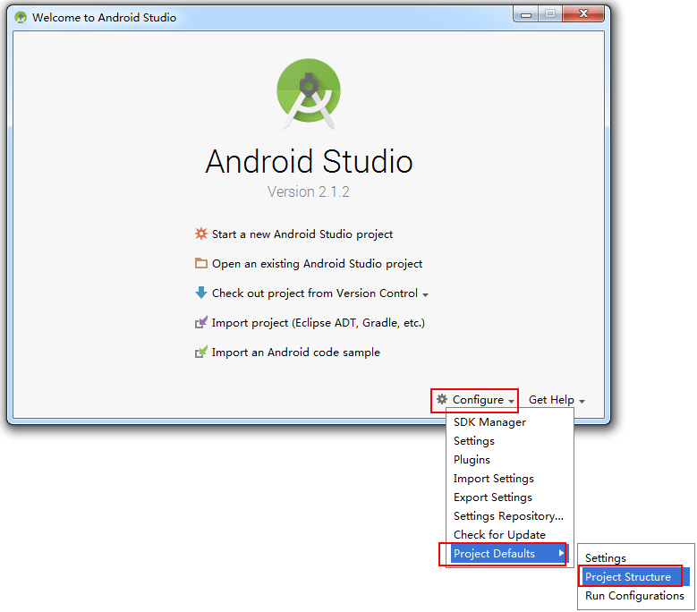
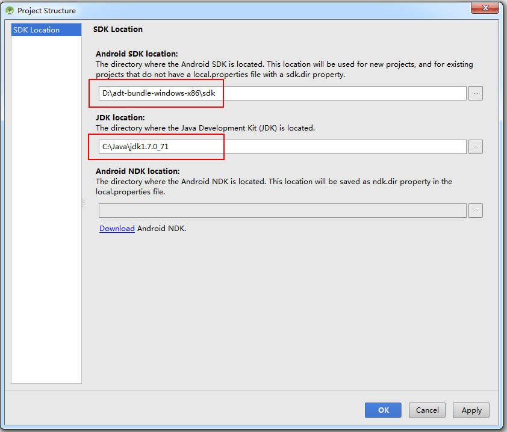

# 配置Java环境

安装Java，配置环境变量JAVA_HOME、Path

# 配置SDK

## 下载sdk安装器

略

## 安装需要的sdk

启动 Android SDK Manager ，打开主界面，依次选择「Tools」、「Options…」，弹出『Android SDK Manager – Settings』窗口；

测试了网上给的好几个镜像都不能用，测试通过的是下面两种方式
1. Shaowsock配置为localhost：1080  或者 
2. 郑州大学mirrors.zzu.edu.cn 端口：80

# 安装Android Studio

## 第一次打开Android Studio时，需要配置JDK和SDK

# 新建项目

用户如果是第一次安装Android Studio，会出现如下窗口：

上图中，是在下载Gradle，文件不大，大概几十兆吧，下载起来很快。由于访问的是国外的网站，建议FQ

# 配置Gradle

下载最新版Gradle：http://services.gradle.org/distributions/ 注意后缀为-all的.zip文件
在project structure中配置gradle和gradle插件的版本

# 其他配置

## 文档悬浮提示

AS默认是没有api文档悬浮提示的，只有按住【Ctrl+Q】太会出现提示。如果要添加api的自动悬浮提示，设置如下：

## 代码自动补齐的功能

代码提示的快捷键是在下面这个位置：

# 项目目录结构

1. gradle和.idea
这两个目录下放置的都是Android Studio自动生成的一些文件，我们无需关心，也不要去手动改动他们

2. app
项目中的代码，资源等内容几乎全部都放置在这个目录下

3. build
这个目录也不要过多关心，它主要包含了一些在编译时自动生成的文件

4. gradle
这个目录下包含了gradle wrapper的配置文件，使用gradle wrapper的方式不需要提前将gradle下载好，而是会自动根据本地的缓存情况决定是否需要联网下载gradle。Android Studio默认没有启动gradle wrapper的方式，如果需要打开，可以点击Android Studio导航栏→File→Setting→Build，Execution，Deployment→Gradle，进行配置更改

5. gitignore
这个文件用来将制定的目录或者文件排除在版本控制之外的，

6. build.gradle
这是项目全局的.gradle构建脚本，通常这个文件的内容是不需要修改。

7. gardle.properties
这个文件是全局的.gradle配置文件，在这里配置的属性将会影响到项目中所有的.gradle编译脚本

8. gradlew和gradlew.bat
这两个文件是用来在命令行界面中执行gradle命令的，其中gradlew是在linux或者Mac系统中使用的，gradlew.bat是在windows系统中使用的

9. MyApplication.iml
是所有IntelliJ IDEA都会自动生成的一个文件，（Android Studio是基于IntelliJ IDEA开发的），用于标识是一个IntelliJ IDEA项目，我们不需要修改这个文件中的任何内容。

10. local.properties
这个文件用于指定本机中的Android SDK路径，通常内容都是自动生成的，我们不需要去修改，除非本机的SDK路径发生了变化，那么就要将这个文件中的路径修改成新的位置路径即可。

11. setting.gradle
这个文件用于指定项目中所有引入的模块，用于MyApplication目前只有一个app模块，因此该文件中也就只入了app这一个模块，而且通常情况下模块的引入都是自动完成的需要我们手动去修改的时候很少

# gradle和gradle插件

gradle和gradle插件是两个不同的东西，二者版本需要匹配才行

## 更新Gradle插件到3.0.1

当更新了Android Studio,你可能会收到提示要求更新Gradle插件到最新版本.你可以选择接受更新,也可以基于你的项目编译要求来手动指定版本.
指定Gradle插件版本有两种方式:
1.	在Android Studio中选择File > Project Structure > Project菜单;
	.	在顶层build.gradle中修改配置.

## 更新Gradle到4.1  http://services.gradle.org/distributions/

当更新了Android Studio,系统会提示要求更新Gradle到最新版本.同更新Gradle插件一样,你可以选择接受更新,也可以基于你的项目编译要求来手动指定版本.
更新Gradle也有两种方式：
1. 通过选择File > Project Structure > Project来指定Gradle版本

2. 在gradle/wrapper/gradle-wrapper.properties文件中编辑Gradle引用地址

# 创建模拟机

## 下载Genymotion

下载的时候需要注册账号 账号：18835109707@163.com 密码zhangzhongjun

## 在AS中添加Genymotion Plugin插件

打开File——Settings——Plugins——Browse Repositories界面

## 关联模拟器设置

选择菜单栏“View--Toolbar”，让工具栏显示出来，可以看到工具栏多了个Genymotion Device Manager的图标

## 还要确保模拟器加载了Android SDK：

## 启动genymotion中的模拟器

选择菜单栏“View--Toolbar”，让工具栏显示出来，可以看到工具栏多了个Genymotion Device Manager的图标，点击这个图标，启动模拟器

## Run app

这是可以看到虚拟器中多了Genymotion中新建的模拟器

# 关联github

## 下载android.gitignore
网址为https://github.com/github/gitignore/blob/master/Android.gitignore

