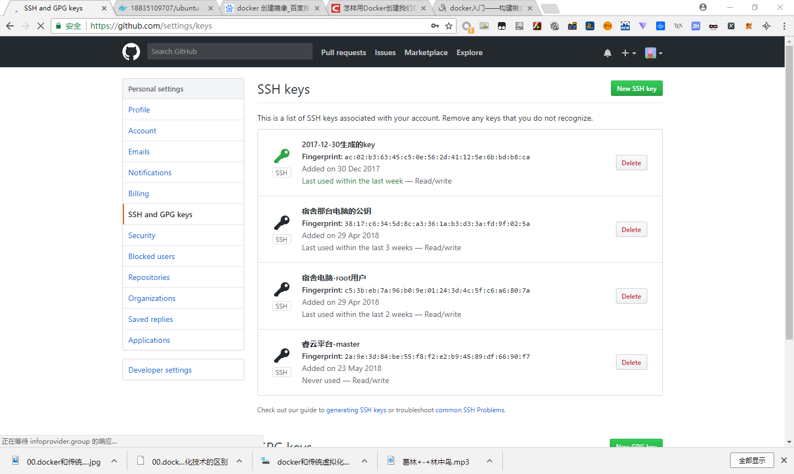

# .gitignore的使用

首先在 https://github.com/github/gitignore 中下载官方例子

添加到.gitignore文件之后，git status不会追踪

# Windows下安装

在 https://gitforwindows.org/ 下载安装文件

#  git的原理

本地仓库由Git维护的三棵“树”组成：

* 工作目录：持有实际文件。

* 缓存区（Index）：像个缓存区域，临时保存做的改动。

* HEAD：指向最近一次提交后的结果

# 配置用户名和邮箱

```bash
git config --global user.name "youname"
git config --global user.email "youeamil@email.com"
```

# 创建密钥

`C:\Users\zhang\.ssh`目录下（或者是/root/.ssh下）
* id_rsa 私钥
* id_rsa.pub 公钥
* known_hosts 信任主机列表


1. 生成新密钥：

```bash
ssh-keygen -t rsa -C "您的email"
```

在回车中会提示你输入一个密码，这个密码会在你提交项目时使用，如果为空的话提交项目时则不用输入，建议采用不输入密码方式。

密钥生成后您可以在你本机系统盘下，您的用户文件夹里发现一个.ssh文件，其中的id_rsa.pub文件里储存的即为刚刚生成的ssh公钥。

2. 使用命令直接复制密钥到剪贴板

```bash
# windows
clip < C:/Users/zhang/.ssh/id_rsa.pub
# ubuntu
xclip -sel clip < file   
```

3. 粘贴到网页上



# git常用操作
|   操作步骤    |                    说明                    |
| :-------: | :--------------------------------------: |
|    安装     | 根据需要安装对应版本：Git Windows版 Git OSX版 Git Linux版 |
|   新建仓库    |      创建新文件夹，打开，然后执行如下命令：`git init`       |
|   检出仓库    | 检出本地仓库：`git clone /path/to/repository` <br>远程仓库：`git clone username@host:/path/to/repository` |
|    添加     | 将改动内容添加到缓存区，使用如下命令：`git add <filename> `或 `git add * ` |
|    提交     | 这是Git基本工作流程的第一步；使用如下命令提交实际改动：<br>git commit -m "代码提交信息"<br>此时改动已经提交到了HEAD，但是还没到远端仓库。 <br> |
|   推送改动    | 改动内容目前已经在本地仓库的HEAD中。执行如下命令以将这些改动提交到远端仓库：<br>`git push origin master`<br>可以将master换成需要推送的任何分支。<br>如果没有克隆现有仓库，且需要将仓库连接到某个远程服务器，可以使用如下命令添加：<br>`git remote add origin <server>`<br>将改动推送到所添加的服务器上。 |
|  替换本地改动   | 如果误操作，可以使用如下命令替换掉本地改动：<br>`git checkout -- <filename>`<br>此命令会使用HEAD中的最新内容替换掉工作目录中的文件。已添加到缓存区的改动，以及新文件，均不受影响。<br>如果需要丢弃所有的本地改动与提交，可以到服务器上获取最新的版本并将本地主分支指向到它：<br>`git fetch origin` <br>`git reset --hard origin/master` |
| 查看所有的提交记录 |                `git log`                 |

# git下载部分文件夹

```bash
mkdir CashScheme
cd CashScheme
git init
git remote add -f origin git@github.com:zhangzhongjun/CashScheme.git
git config core.sparsecheckout true #将sparsesceckout的开关打开
echo params/* >> .git/info/sparse-checkout #linux下需要将params加上双引号
git checkout master
```

如果还需要下载文件夹 src/main/java/com/zhong

```bash
echo src/main/java/com/zhong/* >> .git/info/sparse-checkout #linux下需要将params加上双引号
git checkout master
```


# 创建一个新的仓库

```bash
echo "# asd" >> README.md
git init
git add README.md
git commit -m "first commit"
git remote add origin https://github.com/zhangzhongjun/asd.git
git push -u origin maste
```

# 将已经存在的仓库push到github上

```bash
git remote add origin https://github.com/zhangzhongjun/asd.git
git push -u origin master
```
