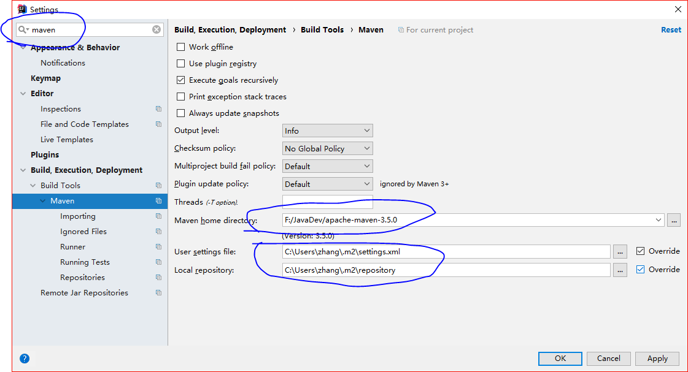

# Ubuntu搭建java环境

1. 下载jdk
  
推荐手动下载，jdk8已经达到180M，还是存盘比较好
```bash
wget http://download.oracle.com/otn-pub/java/jdk/8u171-b11/512cd62ec5174c3487ac17c61aaa89e8/jdk-8u171-linux-x64.tar.gz
```

2. 创建安装的目录,最好自己创建一个，这样的话以后出了问题也能解决

```cmd
mkdir -p /usr/local/java
```

3. 在linux的虚拟机上，我使用这个目录不能够正确的部署，需要使用下面的地址

```cmd
mkdir -p /usr/java
```

4. 解压下载的文件


```cmd
mv jdk1.8.0_151.tar.gz /usr/local/java
cd /usr/local/java
tar -zxvf jdk1.8.0_151.tar.gz
```

5. 重命名文件夹


```cmd
mv jdk1.8.0_151 jdk8
```

6. 配置环境变量


```cmd
/etc/profile
export JAVA_HOME=/usr/local/jdk8
export JRE_HOME=$JAVA_HOME/jre
export CLASSPATH=.:$JAVA_HOME/lib:$JRE_HOME/lib:$CLASSPATH
export PATH=$JAVA_HOME/bin:$JRE_HOME/bin:$PATH
```


7. 使得配置文件生效，但是重新开了一个终端之后，又没有环境变量了

```cmd
source /etc/profile
```

8. 测试一下是否安装成功

```cmd
java -version
```

# Centos搭建Java环境

1. 下载rpm安装包 jdk-8u181-linux-x64.rpm

http://www.oracle.com/technetwork/java/javase/downloads/jdk8-downloads-2133151.html

2. 安装

```bash
rpm -ivh jdk-8u181-linux-x64.rpm
```

3. 是否安装成功

```bash
java -version
```

> 使用这种方式安装好之后，java在/usr/bin/java

注意！！！！

这里是 -version，而不是--version

我用--version，发生了如下的错误

```bash
Unrecognized option: --version
Error: Could not create the Java Virtual Machine.
Error: A fatal exception has occurred. Program will exit.
```

百度之后是内存不够，然后设置了半天。最后最后发现自己忽略了错误提示的第一句话。


# 搭建maven环境

1. 获取最新的资源

```cmd
wget https://mirrors.cnnic.cn/apache/maven/maven-3/3.5.2/binaries/apache-maven-3.5.2-bin.tar.gz
```

2. 解压资源到/usr/local下

```cmd
tar -zxvf apache-maven-3.5.2-bin.tar.gz -C /usr/local
```

3. 修改路径

```cmd
vi /etc/profile
export MAVEN_HOME=/usr/local/apache-maven-3.5.2
export PATH=$PATH:$MAVEN_HOME/bin
```

4. 使得配置生效

```cmd
source /etc/profile
```

5. 测试


```cmd
mvn -version
```

6. 修改maven的源


  windows: 
  linux: cd /usr/local/maven/conf

* 找到maven安装目录下的conf目录下的settings.xml文件
* 设置本地仓库
```xml
<localRepository>D:\Program Files\MavenRepository</localRepository>
```
* 添加阿里源 ，找到  `<mirrors>  </mirrors>`标签，在标签内部 添加内容如下：
```xml
<mirror>
  <id>AliMaven</id>
  <name>aliyun maven</name>
  <url>http://maven.aliyun.com/nexus/content/groups/public/</url>
  <mirrorOf>central</mirrorOf>        
</mirror>
```

7. 直接替换配置文件

* 将标签 localRepository 替换为你自己的本地仓库的路径（使用绝对路径）


* 使用[已经配置好的配置文件](imgs-java环境搭建/settings.xml)  替换 安装目录/conf/settings.xml

# 使用maven

参考 [maven管理java se项目.md](maven管理java se项目.md)


# Ubuntu下安装Intellij Idea

1. 下载

```cmd
https://www.jetbrains.com/idea/download/#section=linux
```

2. 解压

```cmd
tar -zxvf idea_....tar.gz -C /opt/IntellijIdea
```

3. 修改/etc/profile 

```cmd
export PATH=/opt/IntellijIdea/bin:$PATH
```

4. 使配置文件生效


```cmd
source /etc/profile
```

5. 启动


```cmd
idea.sh
```


# 使用Intellij

file > settings > maven > 设置路径和配置文件


