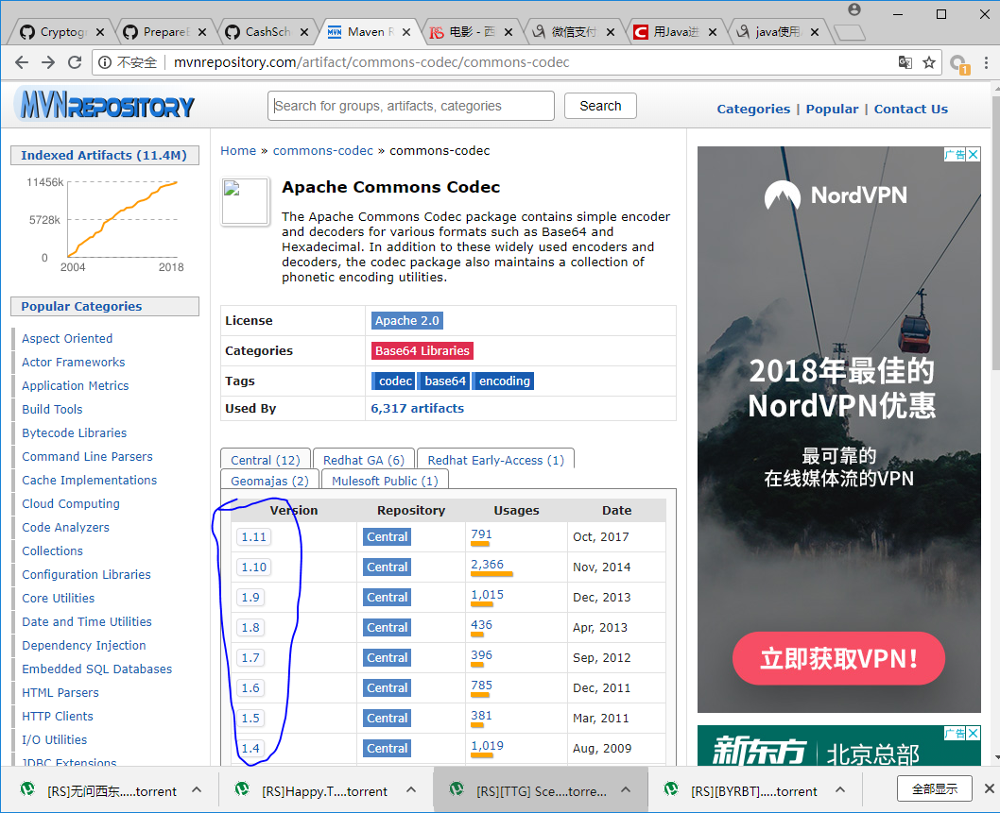

# 如何找pom文件的dependence

网址为  http://mvnrepository.com/

然后点击下图所示的位置即可




# 添加依赖

```xml
<dependency>
	  <groupId>junit</groupId>
	  <artifactId>junit</artifactId>
	  <version>4.11</version>
	  <scope>test</scope>
</dependency>
```
```xml
<!-- https://mvnrepository.com/artifact/commons-io/commons-io -->
<dependency>
	<groupId>commons-io</groupId>
	<artifactId>commons-io</artifactId>
	<version>2.6</version>
</dependency>
```


# 如何排除依赖 避免依赖冲突

```xml
<dependency>  
    <groupId>javax.servlet.jsp.jstl</groupId>  
    <artifactId>jstl-api</artifactId>  
    <version>1.2</version>  
    <exclusions>  
        <exclusion>  
            <groupId>javax.servlet</groupId>  
            <artifactId>servlet-api</artifactId>  
        </exclusion>  
        <exclusion>  
            <groupId>javax.servlet.jsp</groupId>  
            <artifactId>jsp-api</artifactId>  
        </exclusion>  
    </exclusions>  
</dependency> 
```