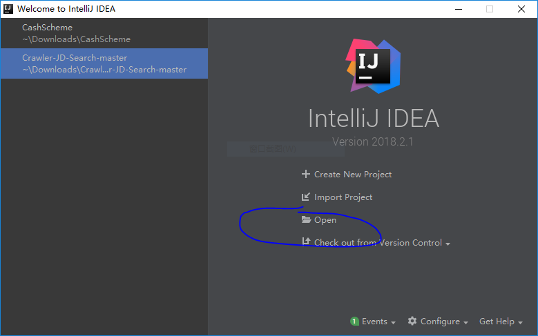

# 使用Maven管理Java SE项目


## 项目的生命流程

1. 清除target中的内容

```bash
$ mvn clean
```

2. 开始编译

```bash
mvn compile
```

3. 不需要传递参数时候，运行主类

```xml
linux: mvn exec:java -Dexec.mainClass="com.example.YourMainClassName" 
mvn exec:java -D"exec.mainClass"="com.example.YourMainClassName"
windows: mvn exec:java -D"exec.mainClass"="com.example.Main"
```


4. 需要传递参数时候，运行主类

```xml
linux: mvn exec:java -Dexec.mainClass="com.vineetmanohar.module.Main" -Dexec.args="arg0 arg1 arg2"
windows: mvn exec:java -D"exec.mainClass"="com.zhong.Main" -D"exec.args"="arg0 arg1 arg2"
```

> 注：可以使用 mvn exec:help -Ddetail=true -Dgoal=java 来查看帮助


5. 运行指定的单元测试  注意大小写

```bash
mvn test -Dtest=TestClassName#testMethod
```

6. 生成java doc
```bash
mvn javadoc:javadoc
```


## Maven项目的组织方式

项目的组织方式可以是多种多样的，但是建议采用官方指定的组织方式

参考官方文档：http://maven.apache.org/guides/introduction/introduction-to-the-standard-directory-layout.html

```bash
-项目名
	-src
		-main
			-java
				-com
					-zhong
						......
			-resource
		-test
			-java
			-resource
	-target 工具为我们生成的文件
		-classes 生成的字节码文件
		-test-classes 生成的字节码文件
	pom.xml	配置文件
```


## Maven的坐标

groupid : 当前maven项目隶属的实际项目
artifactid：当前实际项目中的一个maven项目或模块
version：版本
packing：打包方式 jar或者war

在本地的仓库中 C:\Users\zhang\.m2\repository\你的group id\你的artifactid\你的version\你的artifactid-你的version.你的打包方式


## 修改maven的源

windows
1. 找到maven安装目录下的conf目录下的settings.conf文件


2. 设置本地仓库
```xml
<localRepository>D:\Program Files\MavenRepository</localRepository>
```


3. 添加阿里源 ，找到  `<mirrors>  </ mirrors>`标签，在标签内部 添加内容如下：
```xml
<mirror>
  <id>AliMaven</id>
  <name>aliyun maven</name>
  <url>http://maven.aliyun.com/nexus/content/groups/public/</url>
  <mirrorOf>central</mirrorOf>        
</mirror>
```

Linux

1. 找到maven的安装目录

```bash
cd /usr/local/apache-maven-3.5.4/conf
vi settings.xml
```

2. 同上

---------------------------------------

2018.8起，阿里的maven源发生了改变  https://yq.aliyun.com/articles/621196?spm=a2c40.aliyun_maven_repo.0.0.dc98305440Npwg 

应该采用如下的写法

```xml
<mirror>
  <id>AliMaven</id>
  <name>aliyun maven</name>
  <url>https://maven.aliyun.com/repository/public</url>
  <mirrorOf>central</mirrorOf>        
</mirror>
```

----------------------------------------

## 在IntelliJ中打开maven项目



如上图所示，点击open，然后选中你的项目文件夹


