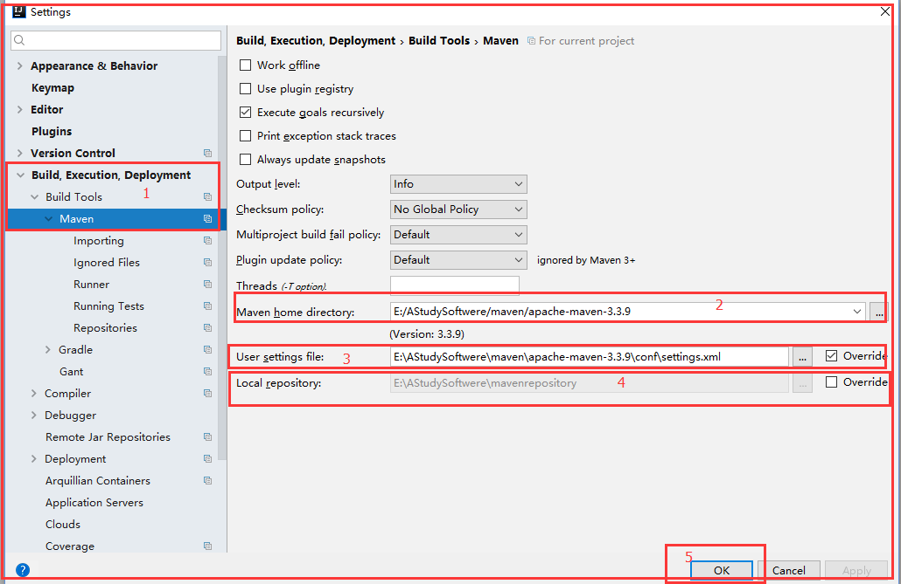
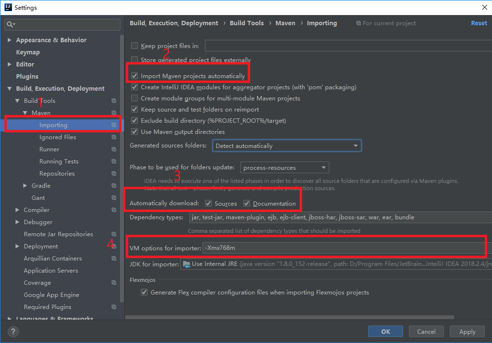

# 重要！！！！

必须要使用intellij idea的utimate版本

不能使用community版本！！

不能使用community版本！！

不能使用community版本！！

community不支持web应用的开发，所以不存在web的facet；新建文件中不存在sevlet

# 在Intellij中配置maven的相关配置

2表示maven的根目录，是你的Maven的安装目录

3表示maven的配置文件，可以在配置文件配置mirror等 setting.xml是一份配好的配置文件，使用阿里云的镜像，很快

4表示本地仓库 C:\Users\zhang\.m2\repository

1 Import Maven projects automatically 表示 IntelliJ IDEA 会实时监控项目的 pom.xml 文件，进行项目变动设置。

2 Automatically download 表示在 Maven 导入依赖包的时候是否自动下载源码和文档。默认是没有勾选的，也不建议勾选，原因是这样可以加快项目从外网导入依赖包的速度，如果我们需要源码和文档的时候我们到时候再针对某个依赖包进行联网下载即可。IntelliJ IDEA 支持直接从公网下载源码和文档的。

3 VM options for inporter 表示设置导入的 VM 参数。一般这个都不需要主动改，除非项目真的导入太慢了我们再增大此参数。