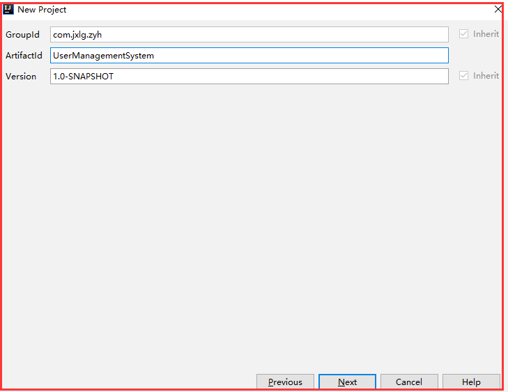

# 创建Java Web项目

注意选择的骨架是maven-archetype-webapp，而不是cocoon-22-archetype-webapp

* GroupId：包名

* ArtifactId：项目名

* Version：版本号

GroupId、ArtifactId、Version三者组成了Maven坐标，是Maven项目中的唯一标识

在这里可以设置maven的根目录和配置文件

在这里设置项目名和项目所在的位置

点击finish之后，Maven会根据刚才的配置创建一个基于Maven的Web App。创建成功之后，其log如上图所示

创建好之后，初始的项目结构如上图所示