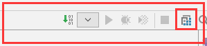
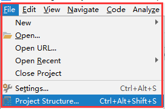
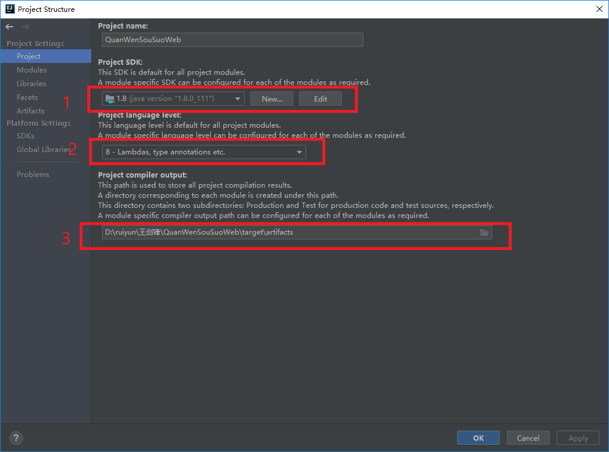
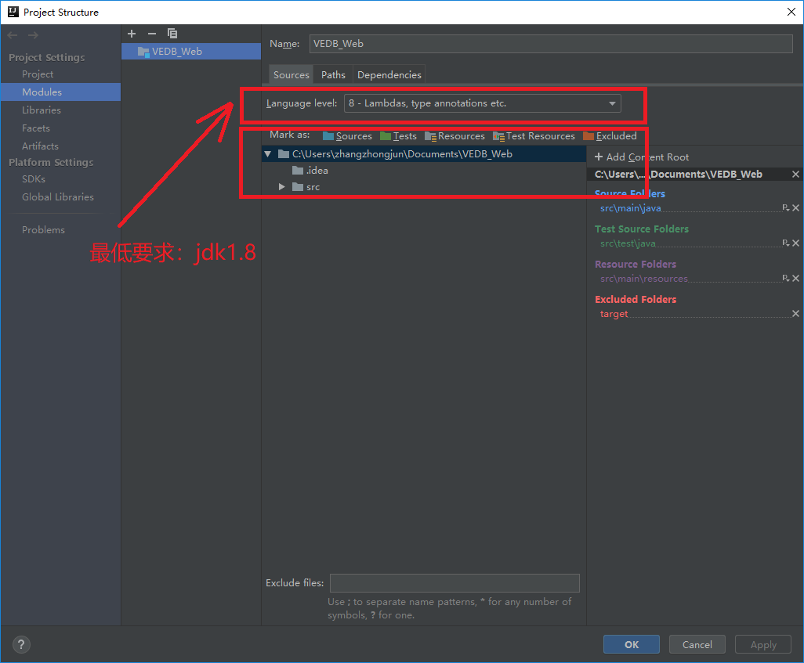
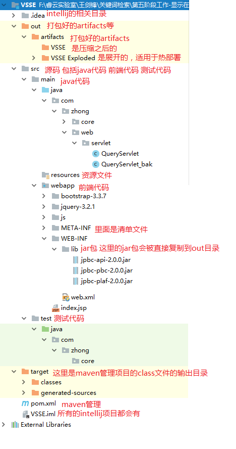
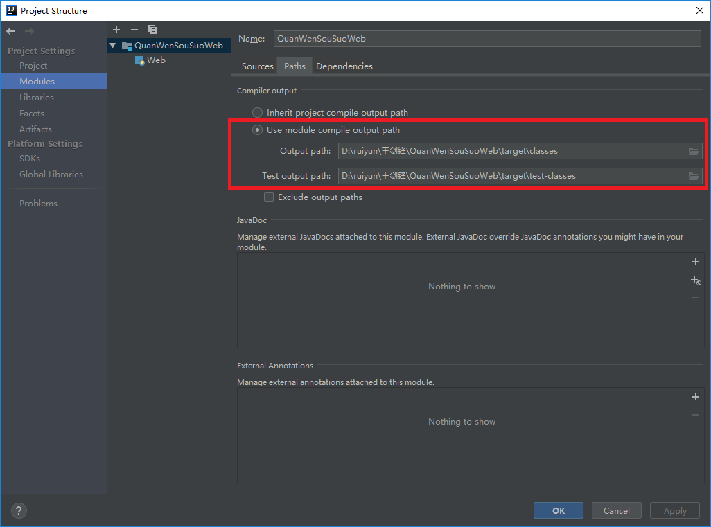
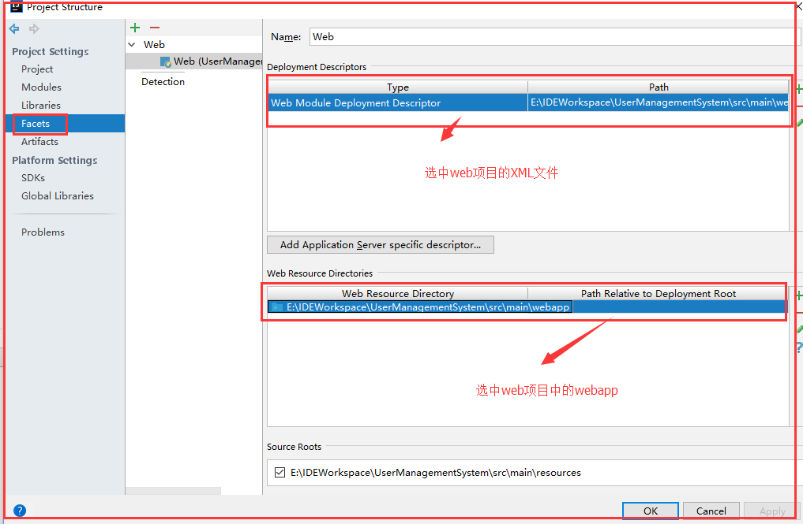
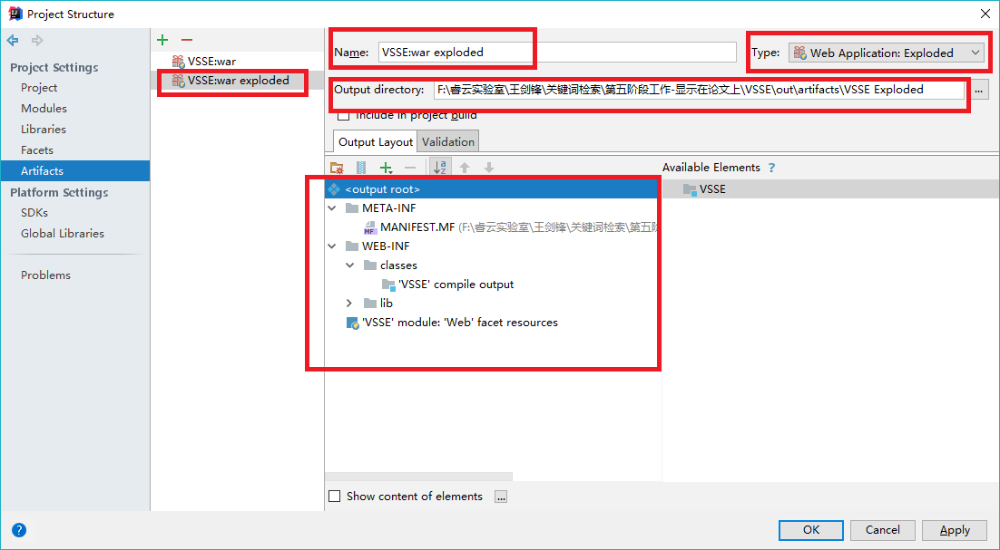
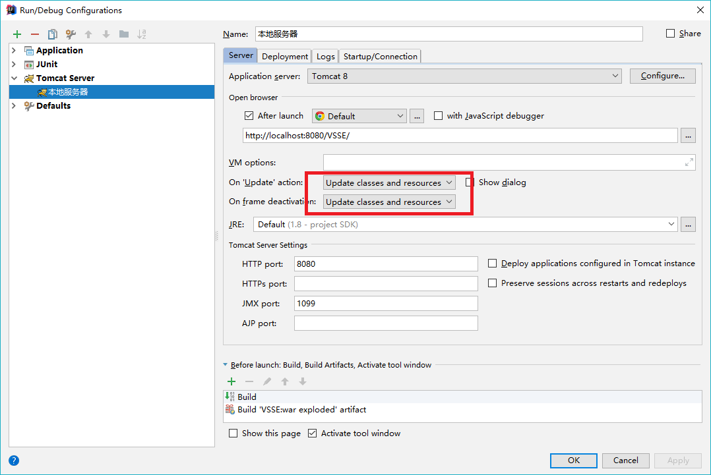
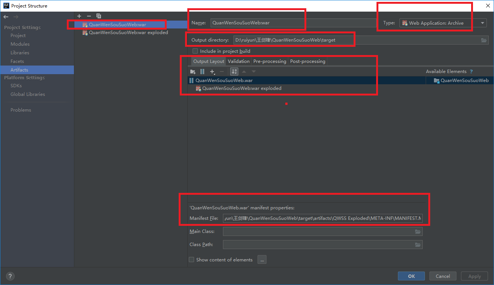

# 配置Java Web项目

# 如何打开“Project Structure”

方式一

方式二

# 配置Project

1配置jdk的位置，点击new之后指定jdk的根目录，则生成一个新的Project SDK

2配置java版本

3配置编译好的class文件的输出路径，不过这个配置项是没有什么实际作用的，主要起作用的是下面的module的配置

> 有三个位置可以配置class文件的输出路径
> 第一个是这里
> 第二个是Module中
> 第三个是Artifacts中

# 配置Module

打开Project Structure下的Modules选项卡

在source选项卡中选择jdk的最低版本

在Sources中按照上图所示的目录结构创建包和文件夹

在Paths中配置Class文件的输出路径

# 配置“Facets”

配置Web的Facets

* Web Resource Directory Path ：指定所需的Web Resource所在的本地目录。

* Relative path in deployment directory ：指定部署Web Resource的相对目录，相对于部署根目录。如果输入斜杠'/'，那么Web Resource目录里的文件将被拷贝到部署目录的根目录。

# 配置Artifacts

* war模式：将WEB工程以包的形式上传到服务器 ；
* war exploded模式：将WEB工程以当前文件夹的位置关系上传到服务器；

1. war模式这种可以称之为是发布模式，看名字也知道，这是先打成war包，再发布；

2. war exploded模式是直接把文件夹、jsp页面 、classes等等移到Tomcat 部署文件夹里面，进行加载部署。因此这种方式支持热部署，一般在开发的时候也是用这种方式。

3. 在平时开发的时候，使用热部署的话，应该对Tomcat进行相应的设置，这样的话修改的jsp界面什么的东西才可以及时的显示出来。

这里的配置十分重要，当你更新.java文件之后，只需要把焦点移出Intellij，便可以更新tomcat服务器中的class文件

