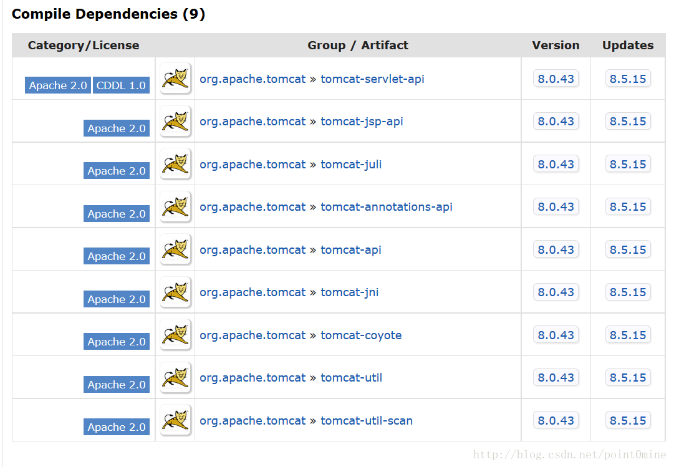

# 配置pom.xml

# 设置编码和jdk版本

```xml
<properties>
	<project.build.sourceEncoding>UTF-8</project.build.sourceEncoding>
	<project.reporting.outputEncoding>UTF-8</project.reporting.outputEncoding>
	<maven.compiler.encoding>UTF-8</maven.compiler.encoding>
	<maven.compiler.source>1.8</maven.compiler.source>
	<maven.compiler.target>1.8</maven.compiler.target>
</properties>
```

# 引入打war包的插件

将所有的依赖，资源文件，类等都打包到一个压缩文件中

```xml
<plugin>
	<groupId>org.apache.maven.plugins</groupId>
	<artifactId>maven-war-plugin</artifactId>
	<version>3.2.0</version>
	<configuration>
		<!-- 这里改变了Exploded的输出路径-->
		<webappDirectory>${project.basedir}/target/artifacts/QWSS Exploded</webappDirectory>
	</configuration>
</plugin>
```

# 引入javaee-api

```xml
<!-- https://mvnrepository.com/artifact/javax/javaee-api -->
<dependency>
	<groupId>javax</groupId>
	<artifactId>javaee-api</artifactId>
	<version>8.0</version>
	<scope>provided</scope>
</dependency>
```

# 引入javaee-web-api

```xml
<!-- https://mvnrepository.com/artifact/javax/javaee-web-api -->
<dependency>
	<groupId>javax</groupId>
	<artifactId>javaee-web-api</artifactId>
	<version>8.0</version>
	<scope>provided</scope>
</dependency>
```

# 引入servlet-api

```xml
<!-- https://mvnrepository.com/artifact/javax.servlet/javax.servlet-api -->
<dependency>
	<groupId>javax.servlet</groupId>
	<artifactId>javax.servlet-api</artifactId>
	<version>4.0.0</version>
	<scope>provided</scope>
</dependency>
```

# 引入jstl-api

```xml
<dependency>
	<groupId>javax.servlet.jsp.jstl</groupId>
	<artifactId>jstl-api</artifactId>
	<version>1.2</version>
	<exclusions>
		<exclusion>
			<groupId>javax.servlet</groupId>
			<artifactId>servlet-api</artifactId>
		</exclusion>
		<exclusion>
			<groupId>javax.servlet.jsp</groupId>
			<artifactId>jsp-api</artifactId>
		</exclusion>
	</exclusions>
</dependency>
```
因为tomcat和jstl-api均编译依赖于servlet-api和jsp-api，所以需要exclusions



# 引入jstl-impl

```xml
<dependency>
	<groupId>org.glassfish.web</groupId>
	<artifactId>jstl-impl</artifactId>
	<version>1.2</version>
	<exclusions>
		<exclusion>
			<groupId>javax.servlet</groupId>
			<artifactId>servlet-api</artifactId>
		</exclusion>
		<exclusion>
			<groupId>javax.servlet.jsp</groupId>
			<artifactId>jsp-api</artifactId>
		</exclusion>
		<exclusion>
			<groupId>javax.servlet.jsp.jstl</groupId>
			<artifactId>jstl-api</artifactId>
		</exclusion>
	</exclusions>
</dependency> 
```

#  生命流程

```bash
mvn compile war:war
mvn compile war:exploded
```