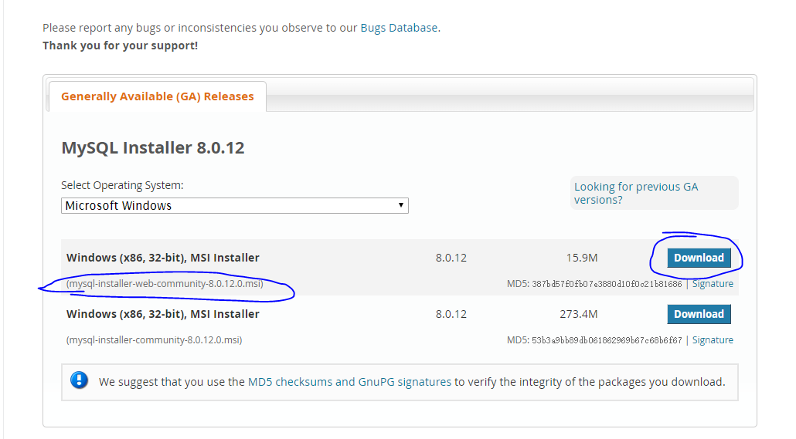

# Ubuntu安装MySql

1. 安装MySql服务器

```bash
sudo apt-get install mysql-server
```

安装过程中可能会提示输入root用户的密码

2. 安装MySql客户端

```bash
sudo apt-get install mysql-client
```

3. 安装MySql的开发包

```bash
sudo apt-get install libmysqlclient-dev
```

4. 本地访问MySql

```bash
mysql -uroot -p你的密码
```

5. 远程访问MySql

* 修改配置文件


```bash
sudo vi /etc/mysql/my.cnf
# 注释掉bind-address = 127.0.0.1
```

* 授权


```bash
# 进入mysql服务
mysql -uroot -proot
# 执行授权命令
grant all on *.* to root@'%' identified by '你的密码' with grant option;
flush privileges;
# 退出mysql服务
quit
# 重启Mysql服务
service mysql restart
```

* 远程访问


```bash
# 远程访问
mysql -uroot -proot -P3306 -h10.170.32.244
```

6. 设置编码

```bash
sudo vi /etc/mysql/my.cnf
# sudo gedit /etc/mysql/my.cnf
character-set-server=utf8
# 重启mysql
service mysql restart
# 进入mysql服务，查看是否配置成功
show variables like 'character%';
```

# Centos安装Ubuntu

1. 安装mysql服务器

CentOS 7的yum源中貌似没有正常安装mysql时的mysql-sever文件，需要去官网上下载

```bash
wget http://dev.mysql.com/get/mysql-community-release-el7-5.noarch.rpm
rpm -ivh mysql-community-release-el7-5.noarch.rpm
yum install mysql-community-server
```

2. 成功安装之后重启mysql服务

```bash
systemctl start mysqld.service
```

3. 设置密码：

初次安装mysql是root账户是没有密码的

```bash
# mysql -uroot
mysql>set password =password('root');
mysql>flush privileges;
```

4. 远程连接

允许root用户在任何地方进行远程登录，并具有所有库任何操作权限，具体操作如下：

在本机先使用root用户登录mysql：

```bash
mysql -u root -p"youpassword" 
```

进行授权操作：

```bash
mysql>GRANT ALL PRIVILEGES ON *.* TO 'root'@'%' IDENTIFIED BY 'youpassword' WITH GRANT OPTION;
```

重载授权表：

```bash
FLUSH PRIVILEGES;
```


退出mysql数据库：

```bash
exit
```

# 113错误解决方案

远程连接时候发生如下的错误
```bash
ERROR 2003 (HY000): Can't connect to MySQL server on '192.168.1.107' (113)
```

错误原因如下

```bash
[root@centos6 data]# perror 113
OS error code 113:  No route to host
```

在防火墙上加上端口的允许

```bash
iptables -I INPUT -s 0/0 -p tcp --dport 3306 -j ACCEPT
```


这条规则的意思是，想要在输入数据INPUT中，protocol为tcp/IP的方式，访问端口3306，都会被允许的

查看是否修改iptables成功

```bash
[root@centos7 /]# iptables -L -n|grep 3306
ACCEPT     tcp  --  0.0.0.0/0            0.0.0.0/0            tcp dpt:3306
```

# windows下安装MySql

# windows安装mysql

1. 去MySQL的官网下载web版的安装文件 

https://dev.mysql.com/downloads/windows/installer/8.0.html




2. 开始安装，注意只需要选择sever即可

> 其他的诸如mysql client、mysql shell、mysql connector等，不需要安装
> 在平时的开发中基本上用不上

3. 将mysql的路径加入到path环境变量中

```bash
C:\Program Files\MySQL\MySQL Server 8.0\bin
```

4. 测试

```bash
mysql -uroot -proot
```
